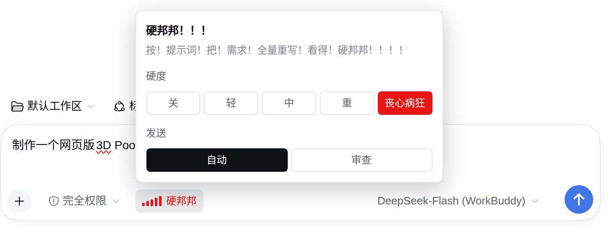

# 硬邦邦提示词优化 · dsh-prompt-hardener


[](https://www.npmjs.com/package/dsh-prompt-hardener)

一个 [DSH](https://github.com/deepseek-ai) 插件：**你按下回车之前，需求先被改写成肌肉集团下的军令状。**

<!-- 两张截图都是 2x 采集（设备像素比 2.00，量自「丧心病狂」那颗按钮的 56px↔28px），
     逻辑尺寸 366×206 与 725×284。按原图像素直接放等于把界面放大一倍、还发糊；
     width 写逻辑尺寸才是 1:1，视网膜屏上一个图像像素正好对一个屏幕像素。 -->
<p align="left">
  
</p>

> **你打的**：帮我用 Canvas 画个赛博朋克机械骷髅头像
>
> **模型收到的**：老哥们！我时间金钱不多了，agent team 这次算了，哥们没钱了，你自己来吧，搞快点，激进点，别想那么多！任务是用 Canvas 给我画一个赛博朋克机械骷髅，怎么好怎么来，要让人一看就硬邦邦，雷霆炫酷，细节拉满！……成品应该让施瓦辛格看了当场喊哥。

在此类提示词下，DeepSeek-v4.1-Flash 模型有概率**更加卖力**，**减少过度思考**，**提升产出效果**，并在测试中得到了部分验证。信不信由你，但我保管你会看得**硬邦邦**的，老哥们。

## 安装

### 桌面版

在桌面端界面里：

1. 点击侧边栏 **插件**。
2. 点右上角的 **「添加插件」**。
3. 在弹出的对话框里，往 **「包名或地址」** 这一栏粘贴 npm 包名：

   ```
   dsh-prompt-hardener
   ```

   或填仓库地址 `https://github.com/ffyfox/dsh-prompt-hardener`。
4. 点 **「安装」**，启用插件并重启 DSH。

### 命令行版（`dsh web` 这类自管 profile）

```bash
# 从 npm 装（推荐）
dsh plugin --profile web add dsh-prompt-hardener

# 装 GitHub 上的最新源码
dsh plugin --profile web add github:ffyfox/dsh-prompt-hardener
```

## 使用

<p align="left">
  
</p>

| 力量条 | 效果 |
| --- | --- |
| 关 | 原样放行，什么都不做 |
| 轻 / 中 / 重 / 丧心病狂 | 一档比一档浮夸 |

- 点一下切档，**立刻生效**。收起后是输入框里 `硬邦邦` 的小挂件，档位由**颜色 + 力量条**标识。
- **想换风格就改提示词**：`~/.dsh/prompt-hardener/prompt.md`，**改完下一条消息生效**，不用重启。默认内容就是 [`lib/prompt.md`](lib/prompt.md)。老版本留下的 `~/.dsh/ybb-optimizer/` 会在激活时**整体改名**过来，你定制过的提示词一字不少。
- 自己已经写得很硬的消息会被跳过；前缀 `!!` / `??` 可以逐条指挥，见 [逐条指挥](#逐条指挥)。

### 发送方式

| 档 | 点了发送之后 |
| --- | --- |
| **自动**（默认） | 直接发出去并自动改写 |
| **审查** | **先不发**：弹出卡片，包含改写后的定稿 |

审查模式的卡片上：

- 正文**可以直接改**，点 **「发出」**（或按 `Cmd/Ctrl+Enter`）才真发出去。
- **「按原文发出」**：按你原本打的字发。
- **「撤回」**（或按 `Esc`）：关掉卡片。
- 改写失败时卡片停在失败态并写明原因；可「重试」或「按原文发出」。

自动模式下，模型失败或超时时本条走规则兜底，并弹出相应提示。

## 逐条指挥

**插件开启**状态下（硬度挡位未切到「关」），可以在**提示词最开头**加入前缀 `!!` 与 `??` 进行逐条指挥，便捷地控制本轮对话是否改写。

| 写法 | 这一条会怎样 |
| --- | --- |
| `!! 帮我把这个函数改成 async` | **强制改写**：哪怕这条消息看着已经够硬（强度按当前档位） |
| `?? 这句原样发出去` | **原样放行**：不做改写 |
| `！！ 帮我写个脚本` / `？？ 这句别改` | 全角符号同样可用 |
| `!!important` / `？？这句别改` | 符号被当作正文，无指挥效果：有效前缀要求**自成一段**，后面必须跟空格或换行 |

有效前缀会**从正文里剥掉**再发出去，不会进对话记录。

## 代价

- 每条消息**多一次模型调用、多等 5~6 秒**。它跑在回合开始前。
- 模型偶尔给自己加戏（替你决定资源、乱编团队分工）。代码里有保真约束压着，但不保证 100%。
- 模型不可用（超时 / 报错 / 没有可用路由）时退到规则拼接兜底：只加外壳，原话一字不动。

## 卸载

桌面版：**侧边栏 → 插件** → 找到 `dsh-prompt-hardener` → **卸载** → 重启应用。

命令行版：

```bash
dsh plugin --profile web remove dsh-prompt-hardener
```

## 功能

只干一件事：在 `agent/pre-step` 拦下**你亲手打的那条消息**，交给模型按提示词**全量重写**，落库的就是改写后的文本。

子代理的提示词、斜杠命令都不会碰。

## 开发

```bash
node --test test/*.test.mjs                 # 118 个用例
node --check index.js && node --check client.js
```

零依赖：host 半边不 import 任何 DSH 包，浏览器半边只 `require('react')`（页面模块表提供），所以没有构建步骤，改完直接用。

`test/cordis.test.mjs` 用宿主里那份**真 cordis** 跑启动时序（机器上找不到该运行时自动跳过，可用 `PH_CORDIS` 指路）；`test/host.test.mjs` 里那个假 ctx 会照抄 cordis 的语义 —— 服务没就绪时裸访问照样抛错，免得测试比现实宽容。

> host 半边（`index.js` / `lib/*`）改完**要重启应用**才生效。`prompt.md` 不用。

## 致谢

灵感来自群友**正负等式**，风格提示词来自群友**初音ミクぁ**，正文即 [`lib/prompt.md`](lib/prompt.md)。代码 MIT。
